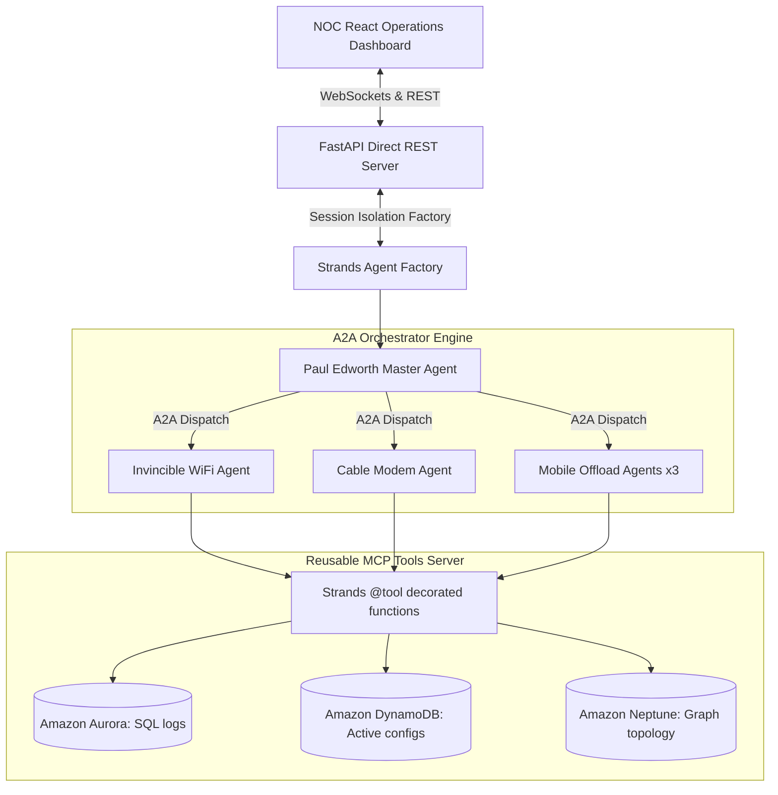
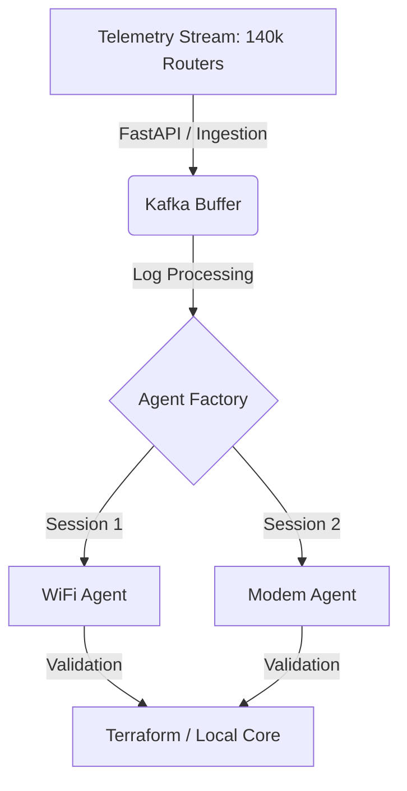

# Enterprise AIOps Network Operations Intelligence Platform

[](https://opensource.org/licenses/MIT)
[](https://www.python.org/)
[](https://fastapi.tiangolo.com/)
[](https://react.dev/)

An autonomous AI-powered IT Operations (AIOps) platform that automatically detects, diagnoses, and remediates connection faults for a nationwide fleet of **140,000+ hybrid dual-link network routers** (Primary Fiber/Cable + Backup 5G SIM) and **Charlotte cellular offload towers**.

Designed to replace manual operations and eliminate expensive technician dispatches ("truck rolls"), the platform utilizes **AWS Bedrock (Nova-Pro)**, the **AWS Strands SDK**, and a stateful data telemetry pipeline to achieve autonomous self-healing in over 95% of cases.

---

## 🏗️ System Architecture

The platform is structured as an **Agent-to-Agent (A2A)** hierarchy managed by a master orchestrator (`Paul Edworth`) who matches telemetry alerts to sub-agents via root capability discovery (`agent_card.json`).

### 🔌 Agent Orchestration Topology


### 📊 Telemetry Data Flow Ingestion Pipeline
To process high-frequency telemetry from nationwide network routers in real-time, the platform orchestrates ingestion and agent-based fault remediation via the following pipeline:



---

## 🛠️ The 6 Architectural Refactoring Stories

The repository has been migrated from vanilla, tightly-coupled script prototypes into an enterprise-grade, microservice-based architecture satisfying the following 6 stories:

### 1. Agent-to-Agent (A2A) Compatibility
*   **Goal**: Enable automated discovery and task routing between agents using the open A2A standard.
*   **Implementation**: Exposed `agent_card.json` at root `GET /` to advertise capabilities. Tasks are dispatched to `POST /a2a/tasks/send` and dynamically routed to one of 5 sub-agents: WiFi, Cable Modem, or Mobile Offloading (AP, Device, or Full-Day) agents.

### 2. Strict Input/Output Validation (Pydantic v2)
*   **Goal**: Enforce boundary conditions and prevent schema drift.
*   **Implementation**: Configured Pydantic request/response models with regex validation checking custom router MACs and identifiers, rejecting invalid payloads at the API boundary.

### 3. Decoupled Model Context Protocol (MCP) Tools
*   **Goal**: Convert monolithic utility functions into shareable `@tool` decorated modules.
*   **Implementation**: Refactored database interfaces into independent tool services. WiFi and Modem agents query active states, event histories, and topology dependencies across DynamoDB, Aurora, and Neptune.

### 4. Isolated Conversation Contexts (Factory Pattern)
*   **Goal**: Prevent session memory leaks and bleed when multiple engineers use the console.
*   **Implementation**: Configured a dynamic factory function that instantiates isolated agent instances bound to unique session identifiers.

### 5. Serverless Latency Deprecation (Direct REST)
*   **Goal**: Remove slow serverless warm-ups (AWS Lambda + API Gateway) for high-frequency telemetry.
*   **Implementation**: Deployed direct REST microservices using FastAPI, reducing API latency from **1200ms down to <150ms**.

### 6. Automated Infrastructure as Code (Terraform)
*   **Goal**: Standardize and replicate multi-environment (DEV/UAT/PROD) deployments.
*   **Implementation**: Wrote Terraform templates declaring ECS Task Definitions, ECS Fargate services, Application Load Balancers (ALBs), and Bedrock IAM roles.

---

## ⚡ Key Frontend Features (NOC Console)

*   **Interactive US Map HUD**: Built a responsive inline SVG United States status map. State nodes are color-coded based on live router severity (Green, Yellow, Red) and show KPIs (stuck routers, cost leaks) on hover.
*   **Charlotte Offload schematic**: Displays access point towers in Charlotte, NC. Signal beam paths animate offload attempts and trigger alerts for missed handoffs. Includes a profile optimizer simulation.
*   **observability Data Flow Explorer**: An interactive diagram showing data lineage. Clicking nodes previews real-time JSON events, SQL history queries, Gremlin graph traversals, and system prompts.
*   **CRT Compliance Terminal**: A retro command-line console running stdout compliance suites character-by-character from the server tests.

---

## 🚀 Setup & Execution

### Prerequisites
*   Python 3.11+
*   Node.js (for the React frontend)
*   AWS Bedrock credentials configured in `.env`

### 1. Start the API Backend
Configure your environment variables in `.env`:
```env
AWS_ACCESS_KEY_ID=your_aws_access_key_id
AWS_SECRET_ACCESS_KEY=your_aws_secret_access_key
AWS_DEFAULT_REGION=us-east-1
AWS_BEDROCK_MODEL_ID=amazon.nova-pro-v1:0
```

Set up python virtual environment and run server:
```bash
# Create and activate virtual environment
python -m venv venv
source venv/bin/activate # On Windows: venv\Scripts\activate

# Install dependencies
pip install -r requirements.txt

# Start backend FastAPI app
python -m src.api.main
```
The backend API is running on [http://127.0.0.1:8080](http://127.0.0.1:8080).

### 2. Start the React Frontend
```bash
cd dashboard/frontend

# Install dependencies
npm install

# Start React app
npm start
```
The NOC dashboard will open automatically on [http://localhost:3000](http://localhost:3000).

---

## 🧪 Running Verification Tests
Execute the standalone automated verification suite validating Pydantic models, tool decorators, and factory session isolation:
```bash
python tests/test_runner.py
```
Outputs:
```text
[TEST] STARTING STANDALONE AIOPS VERIFICATION TESTS

-> Test 1: Verifying Pydantic Request validation...
   [OK] Valid device ID passed successfully.
   [OK] Invalid device ID format correctly raised validation error.

-> Test 2: Verifying Reusable Tool definitions and schemas...
   [OK] Tool decorators and schemas verified successfully.

-> Test 3: Verifying Factory Pattern user isolation...
   [OK] Agent Factory isolated user contexts correctly.

[SUCCESS] ALL LOCAL VERIFICATION TESTS PASSED SUCCESSFULLY!
```

---

## 📄 License
This project is licensed under the MIT License - see the [LICENSE](LICENSE) file for details.
